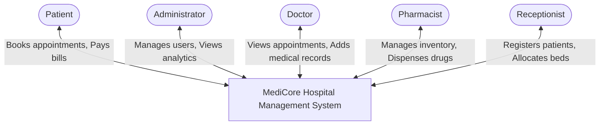
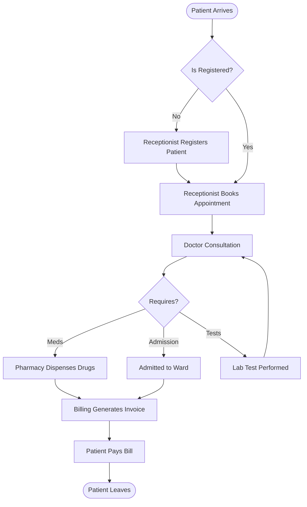
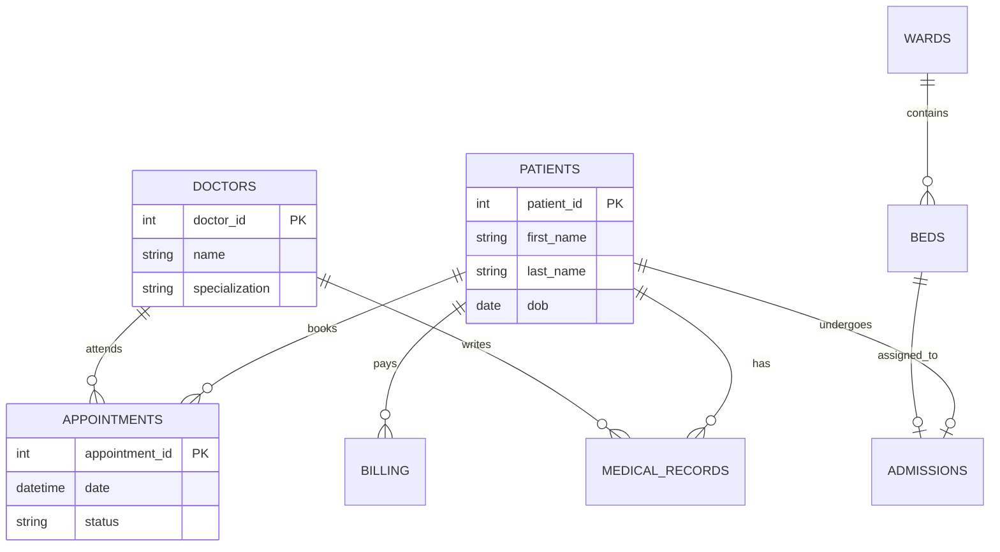

# Software Engineering Group Project: Hospital Management System (HMS)

This document contains all the necessary information, diagrams, and content required to fulfill your Software Engineering Group Project assignment. You can use the text and diagrams below to build your final presentation.

---

## 1. Project Topic
**Project Chosen:** Hospital Management System (HMS)
**System Name:** MediCore HMS
**Problem Statement:** Hospitals struggle with manual paperwork, disjointed communication between departments (doctors, pharmacy, billing), and inefficient patient tracking. MediCore HMS centralizes all hospital operations into a single digital platform to improve patient care and administrative efficiency.

## 2. Functional Requirements
The system performs the following six major functions:
1. **User Authentication & Role Management:** Secure login system that routes users (Admin, Doctor, Receptionist, Pharmacist, Billing) to customized dashboards based on their role.
2. **Patient Registration & Profiling:** Ability to add new patients, store demographics, and view a comprehensive chronological medical history timeline.
3. **Appointment Scheduling:** System to book, view, and manage patient appointments with specific doctors.
4. **Inpatient Ward Management:** Capability to allocate available beds, admit patients to wards, and discharge them to free up resources.
5. **Pharmacy & Laboratory Management:** Track medicine inventory, dispense drugs, and order/update patient lab test results.
6. **Billing & Invoicing:** Automatically generate bills for consultations and treatments, process payments, and track revenue.

---

## 3. System Models (Diagrams)

*Note: The following diagrams are written using Mermaid.js syntax. If you are using draw.io or Visio, you can recreate these structures based on the logic below, or use a Mermaid-to-image converter.*

### A. Context Diagram
Shows the system at the center and how external entities interact with it.



### B. Use-Case Diagram
Shows the actors and their specific actions within the system.

```mermaid
usecaseDiagram
    actor Receptionist
    actor Doctor
    actor Pharmacist
    
    package "MediCore HMS" {
        usecase "Register Patient" as UC1
        usecase "Schedule Appointment" as UC2
        usecase "Admit to Ward" as UC3
        usecase "Add Diagnosis/Prescription" as UC4
        usecase "Dispense Medication" as UC5
        usecase "Generate Bill" as UC6
    }
    
    Receptionist --> UC1
    Receptionist --> UC2
    Receptionist --> UC3
    
    Doctor --> UC4
    Doctor --> UC3
    
    Pharmacist --> UC5
```
*(You can draw this with standard stick figures in draw.io)*

### C. Flowchart (Patient Visit Workflow)
Shows the sequence of operations for a standard patient visit.



### D. Entity-Relationship (ER) Diagram
Shows the database structure.



---

## 4. Prototype
**Tech Stack Used:**
- **Frontend:** HTML5, Vanilla CSS (Mobile Responsive), JavaScript (Single Page Application architecture), Chart.js for analytics.
- **Backend:** Python (Flask API)
- **Database:** MySQL relational database.
**Status:** A fully functional prototype has been built and deployed locally, demonstrating role-based routing, real-time dashboards, and database persistence.

## 5. Testing Methodology
**Method Chosen:** System Testing & End-to-End (E2E) Testing
**Justification:** Because this HMS is a full-stack web application, Unit Testing alone is insufficient. System Testing allows us to evaluate the integrated system as a whole. It ensures that when a Receptionist books an appointment on the front-end UI, the data correctly traverses the Flask API, adheres to the MySQL database constraints, and successfully appears on the Doctor's dashboard. This verifies that all functional requirements are met in a real-world scenario.

## 6. Development Process Model
**Model Chosen:** Agile (Scrum) Methodology
**Justification:** Developing a complex HMS involves multiple interdependent modules (Pharmacy, Billing, Wards). Agile allowed us to build the system iteratively. We started with a Minimum Viable Product (patient registration and login) in the first sprint, and subsequently added complex features (Charts, Ward Admissions) in later sprints. This flexibility allowed us to adapt to database constraint challenges without derailing the entire project timeline, which would have been a risk with a rigid Waterfall model.

---

## 7. Presentation Outline (12 Slides)

Here is the exact content you should put on your 12 presentation slides.

**Slide 1: Title Page**
- **Title:** MediCore Hospital Management System
- **Subtitle:** Software Engineering Group Project
- **Team Members:** [List your names]
- **Date:** [Presentation Date]

**Slide 2: Project Objectives**
- Digitize manual hospital paperwork.
- Centralize data across departments (Clinical, Pharmacy, Billing).
- Provide role-specific secure access to sensitive medical data.
- Improve patient care through efficient workflow tracking.

**Slide 3: Functional Requirements**
- User Authentication & Role Management.
- Patient Registration & Demographics.
- Appointment & Schedule Management.
- Inpatient Ward & Bed Allocation.
- Pharmacy Inventory Tracking.
- Financial Billing & Invoicing.

**Slide 4: Development Process Model**
- **Chosen Model:** Agile Methodology.
- **Why?** Allowed iterative development. We built the core framework first (MVP), then added modules (Wards, Analytics) sequentially. It provided flexibility to adapt to technical challenges during database integration.

**Slide 5: Context Diagram**
- *(Insert the Context Diagram image here)*
- **Explanation:** Shows our central HMS interacting with Doctors, Patients, Admins, Pharmacists, and Receptionists.

**Slide 6: Use-Case Diagram**
- *(Insert the Use-Case Diagram image here)*
- **Explanation:** Highlights role constraints. Receptionists manage registration, Doctors manage clinical records, Pharmacists handle inventory.

**Slide 7: System Flowchart**
- *(Insert the Flowchart image here)*
- **Explanation:** Traces the lifecycle of a patient visit from walk-in, to diagnosis, to billing and exit.

**Slide 8: Database Architecture (ER Diagram)**
- *(Insert the ER Diagram image here)*
- **Explanation:** Shows the relational mapping between Patients, Doctors, Appointments, and Medical Records ensuring data integrity.

**Slide 9: The Prototype (Architecture)**
- **Frontend:** Single Page Application (HTML/CSS/JS). Mobile responsive.
- **Backend:** Python Flask API handling RESTful routing.
- **Database:** MySQL with strict foreign key constraints and triggers.

**Slide 10: Prototype Showcase (Features)**
- *(Insert a screenshot of the Admin Dashboard with charts)*
- Highlight the beautiful Chart.js analytics.
- Highlight the dynamic "Patient Timeline" UI.

**Slide 11: Testing Strategy**
- **Method:** System Testing (End-to-End).
- **Why?** To validate the entire data flow from the UI layer, through the Python API network layer, down to the database constraints, ensuring the system operates as one cohesive unit.

**Slide 12: Conclusion & Future Enhancements**
- **Conclusion:** We successfully engineered a robust, secure, and scalable Hospital Management System within the deadline.
- **Future Enhancements:** Integration with external insurance APIs, AI-based disease prediction, and SMS notifications for patient appointments.
- **Q&A Session**
